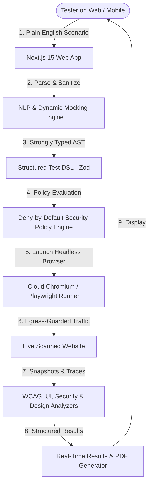

# Webtest Scanner

> **Automated, intelligent web application testing and auditing driven by plain English.**  
> Real browser automation, screenshot evidence, accessibility audits, security header checks, and design token extraction — all accessible directly from your browser.

🌐 **Live Website**: [https://webtest-scanner-web.vercel.app/](https://webtest-scanner-web.vercel.app/)

---

## 🎯 How to Use the Web Application

You can use the scanner instantly without installing or cloning anything locally:

1. **Access the Web App**: Open [**https://webtest-scanner-web.vercel.app/**](https://webtest-scanner-web.vercel.app/) in any web browser.
2. **Sign In**: Authenticate using **Google Sign-In** or create an account with your **Email & Password**.
3. **Configure Your Target**:
   - Enter any public website URL (e.g. `https://example.com` or `https://github.com`).
   - Choose your testing environment (`QA`, `STAGING`, `PRODUCTION`, etc.).
   - Select your target ownership tier (Tier 0 for public observation).
4. **Choose Test Categories**:
   - ✅ **Functional Scenario**: Clicks, forms, navigation, and custom text assertions.
   - ✅ **UI / Visual**: Broken images, layout overflows, clipped text, and tap target sizes.
   - ✅ **Design & Assets**: Typography scales, color palettes, and layout rhythm.
   - ✅ **Accessibility (WCAG 2.1 AA)**: Automated audits powered by `axe-core`.
   - ✅ **Passive Security**: TLS checks, CSP, security response headers, cookie flags, and mixed content.
   - ✅ **Performance**: TTFB, First Paint, DOM Ready time, and resource payload weight.
5. **Write Steps in Plain English**:
   ```
   go to /
   click "Pricing"
   verify "$0" is visible
   take a screenshot
   ```
   *(Supports dynamic test data generators like `{{random.email}}`, `{{random.uuid}}`, `{{random.string}}`)*
6. **Run & Review**:
   - Click **Run test** (or press <kbd>⌘</kbd>+<kbd>Enter</kbd>).
   - Watch the cloud browser execute your journey with live screenshot evidence.
   - Download the clean, print-optimized **PDF Report**.

---

## 🚀 How Does It Work?



### The 6-Stage Execution Pipeline

1. **Natural Language Translation & Data Mocking (`@wts/nlp`, `@wts/data-forge`)**:
   - Translates human-written instructions into structured test actions.
   - Dynamically evaluates mock tokens (`{{random.email}}`, `{{random.uuid}}`, security payloads).
   - Sanitizes inputs to prevent prompt injection attacks.

2. **Strict Test DSL Compilation & Linting (`@wts/dsl`)**:
   - Compiles user intent into a closed, strongly-typed schema validated with **Zod**.
   - Actions are strictly bounded to safe browser verbs (`navigate`, `click`, `fill`, `assert`, `wait`). No raw JavaScript execution or arbitrary selectors are permitted.
   - Validates preconditions and lints for logical conflicts.

3. **Deny-by-Default Policy & Ownership Guard (`@wts/policy`, `@wts/ownership`)**:
   - Evaluates target ownership tiers (Tier 0: Observation, Tier 1: DNS Verified, Tier 2: Signed Attestation).
   - Hard blocks restricted domains (government, military, cloud metadata, private/internal IP ranges) before launching a browser.
   - Restricts HTTP methods, request rates, and enforces data lineage safety.

4. **Headless Browser Execution (`@wts/runner`)**:
   - Launches Chromium in cloud serverless environments (`@sparticuz/chromium`) or dedicated workers.
   - Automatically handles slow target timeouts, bypasses bot detection fingerprinting (`--disable-http2`), and halts background requests (`window.stop()`) to prevent execution context destruction.
   - Runs an **Egress Guard** on all network traffic to detect third-party leakage.

5. **Multi-Category Auditing & Verification (`@wts/analyzers`)**:
   - **Functional**: Asserts DOM state, element visibility, and journey completion.
   - **UI / Visual**: Heuristic layout analysis for element overlap, clipped containers, and broken assets.
   - **Accessibility**: Audits WCAG 2.1 AA rules using **axe-core**.
   - **Passive Security**: Inspects HTTPS enforcement, CSP, security response headers, cookie flags, mixed content, and form action protocols.
   - **Performance**: Records TTFB, First Paint, DOM Ready time, request counts, and resource transfer weight.

6. **Interactive Dashboard & PDF Generation (`@wts/web`)**:
   - Displays a tabbed interface with category scores, issue severities, and full screenshot galleries.
   - Generates downloadable, print-optimized **PDF reports** directly from the browser.

---

## 🛠️ Tech Stack

### 🌐 Frontend & Web Application
* **Framework**: [Next.js 15](https://nextjs.org/) (App Router, Server Components & Route Handlers)
* **UI Library**: [React 19](https://react.dev/)
* **Language**: [TypeScript 5](https://www.typescriptlang.org/) (Strict Mode)
* **Styling**: Pure CSS Design System with Glassmorphism, CSS Custom Properties, and responsive layouts
* **Authentication**: [Firebase Authentication v12](https://firebase.google.com/products/auth) (Google OAuth, Email/Password, AuthContext Provider, Route Protection Gate)

### 🤖 Browser Automation & Testing Engines
* **Browser Engine**: [Playwright](https://playwright.dev/) & `playwright-core`
* **Serverless Chromium**: [`@sparticuz/chromium`](https://github.com/Sparticuz/chromium) (Vercel Serverless & AWS Lambda runtime)
* **Accessibility Engine**: [`axe-core`](https://github.com/dequelabs/axe-core) (WCAG 2.1 AA)
* **Schema Validation**: [Zod 3](https://zod.dev/)
* **Data Mocking**: `@wts/data-forge` (dynamic data generation and boundary security payloads)

### 🏗️ Architecture & Cloud Infrastructure
* **Monorepo Build System**: [Turborepo 2](https://turbo.build/repo)
* **Test Suite**: [Vitest](https://vitest.dev/) (353 unit tests with 100% security branch coverage)
* **Hosting**: [Vercel](https://vercel.com/) (Edge Network & Serverless Next.js Hosting)
* **Cloud & Identity**: [Google Cloud Platform / Firebase](https://firebase.google.com/) (`webtest-scanner-7989`)

---

## 📦 Package Directory

| Package | Purpose |
|---|---|
| `@wts/web` | Next.js 15 Web App, `/login` authentication, dashboard, and `/api/run` orchestrator |
| `@wts/dsl` | Zod schemas for Test DSL, semantic targets, assertions, and linter rules |
| `@wts/policy` | Deny-by-default execution policy matrix and permission guards |
| `@wts/ownership` | DNS TXT domain verification, capability tiers, and hard denylists |
| `@wts/nlp` | Natural language rule parser & prompt injection sanitization |
| `@wts/data-forge` | Dynamic data generator (UUID, Strings, Emails, Security Payloads) |
| `@wts/analyzers` | WCAG 2.1 AA, UI visual, Design, Security, and Performance analyzers |
| `@wts/runner` | Playwright execution engine, egress guard, and serverless chromium switcher |

---

## 🛡️ Capability & Ownership Tiers

| Tier | Proof Required | Permitted Capabilities |
|---|---|---|
| **Tier 0** | None (Public) | Observation only: GET/HEAD requests, ≤1 rps, screenshots, accessibility audit, passive security header checks |
| **Tier 1** | DNS TXT Record | Form submissions, CRUD operations, authenticated user journeys, API contract inspection, asset downloads |
| **Tier 2** | DNS TXT + Signed Attestation | Active security probing, authorization matrices, IDOR detection, session token audits |

---

## 📄 License

MIT License. Designed and built with strict security-first principles.
